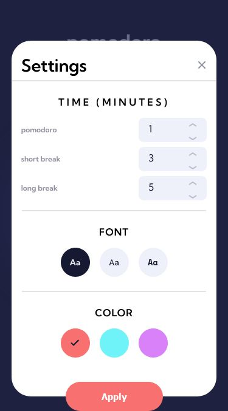
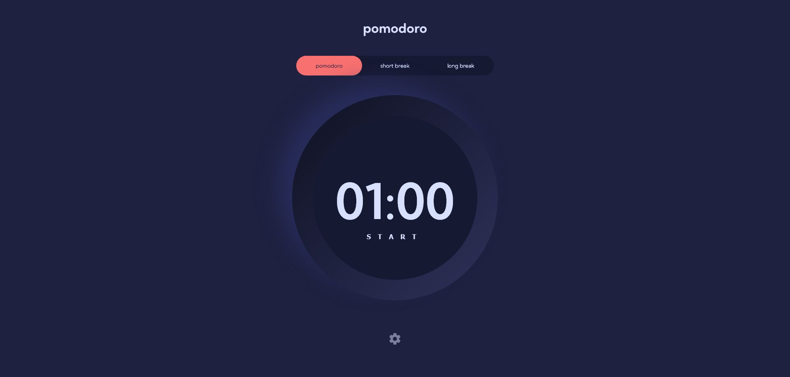

# Frontend Mentor - Pomodoro app solution

This is a solution to the [Pomodoro app challenge on Frontend Mentor](https://www.frontendmentor.io/challenges/pomodoro-app-KBFnycJ6G). Frontend Mentor challenges help you improve your coding skills by building realistic projects. 

## Table of contents

- [Overview](#overview)
  - [The challenge](#the-challenge)
  - [Screenshot](#screenshot)
  - [Links](#links)
- [My process](#my-process)
  - [Built with](#built-with)
  - [What I learned](#what-i-learned)
  - [Continued development](#continued-development)
  - [Useful resources](#useful-resources)
- [Author](#author)
- [Acknowledgments](#acknowledgments)

**Note: Delete this note and update the table of contents based on what sections you keep.**

## Overview
This is a project on the Pomodoro app challenge from frontend mentor. Recieved through Amalitech Training Programme
### The challenge

Users should be able to:

- Set a pomodoro timer and short & long break timers
- Customize how long each timer runs for
- See a circular progress bar that updates every minute and represents how far through their timer they are
- Customize the appearance of the app with the ability to set preferences for colors and fonts

### Screenshot








Add a screenshot of your solution. The easiest way to do this is to use Firefox to view your project, right-click the page and select "Take a Screenshot". You can choose either a full-height screenshot or a cropped one based on how long the page is. If it's very long, it might be best to crop it.

Alternatively, you can use a tool like [FireShot](https://getfireshot.com/) to take the screenshot. FireShot has a free option, so you don't need to purchase it. 

Then crop/optimize/edit your image however you like, add it to your project, and update the file path in the image above.

**Note: Delete this note and the paragraphs above when you add your screenshot. If you prefer not to add a screenshot, feel free to remove this entire section.**

### Links

- Solution URL: [Add solution URL here](https://github.com/kayjob/promodo-app-stopwatch)
- Live Site URL: [Add live site URL here](https://your-live-site-url.com)

## My process

### Built with

- Semantic HTML5 markup
- CSS custom properties
- Flexbox
- Mobile-first workflow
- [jQuery](https://jquery.com/) - JS library

**Note: These are just examples. Delete this note and replace the list above with your own choices**

### What I learned

Learnt how to how to execute scripts after every specific time in javascript using the setInerval function

function startTimer(){
    int=setInterval(displayTimer,1000);
}
An example in the function above, when ran, will execute "displayTimer" exery second

```js
function startTimer(){
    int=setInterval(displayTimer,1000);
}
```


If you want more help with writing markdown, we'd recommend checking out [The Markdown Guide](https://www.markdownguide.org/) to learn more.

**Note: Delete this note and the content within this section and replace with your own learnings.**

### Continued development

I want to continue focusing on javascript and logic. Finding about ways to execute the task was really exciting. Also continue with css and learn more about styling.

**Note: Delete this note and the content within this section and replace with your own plans for continued development.**

### Useful resources

- [jQuery learning center](https://css-tricks.com/how-to-create-an-animated-countdown-timer-with-html-css-and-javascript/) - This helped me understand how to implement svg for the timer face. I really liked this pattern and will use it going forward.
- [jQuery learning center](https://learn.jquery.com/) - This is an help page which helped me understand more about jQuery. I'd recommend it to anyone still learning this concept.

**Note: Delete this note and replace the list above with resources that helped you during the challenge. These could come in handy for anyone viewing your solution or for yourself when you look back on this project in the future.**

## Author

- Github - [Ansu Kwabena Yeboah](https://github.com/kayjob/)

**Note: Delete this note and add/remove/edit lines above based on what links you'd like to share.**

## Acknowledgments

I would like to thsnk God. Also I would like to thank the staff of the Amalitech Training Institute for the opprotunity

**Note: Delete this note and edit this section's content as necessary. If you completed this challenge by yourself, feel free to delete this section entirely.**
